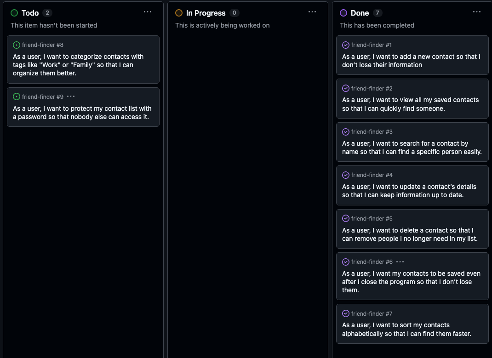

# [friend-finder](https://friend-finder-py-77390a27fd18.herokuapp.com)

FriendFinder is a simple command-line contact book built with Python. It allows users to add, view, search, update, and delete contacts through an intuitive text-based interface. All data is stored in a connected Google Sheet using the gspread library, ensuring that contacts are saved and accessible across sessions. FriendFinder is designed to be lightweight, functional, and a great introduction to using Python with external APIs for real-world applications.

[Visit the site here](https://friend-finder-py-77390a27fd18.herokuapp.com/) 

source: [friend-finder amiresponsive](https://ui.dev/amiresponsive?url=https://friend-finder-py-77390a27fd18.herokuapp.com)

> [!IMPORTANT]
> The examples in these templates are strongly influenced by the Code Institute walkthrough project called "Love Sandwiches".

## UX

### The 5 Planes of UX

#### 1. Strategy Plane
##### Purpose
- Provide users with a simple and effective way to manage and store personal or professional contact information.
- Make it easy to access, update, and maintain contact records via a user-friendly CLI.

##### Primary User Needs
- Add, view, search, update, and delete contacts quickly and efficiently.
- Ensure that contacts are saved across sessions and accessible anytime.
- Use a clear and intuitive interface that doesn't require technical expertise.

##### Business Goals
- Offer a lightweight yet powerful contact management tool using Python and Google Sheets.
- Demonstrate practical Python skills with external APIs for real-world data handling.
- Help users stay organized and connected by simplifying contact management.

#### 2. Scope Plane
##### Features
- A full list of [Features](#features) can be viewed in detail below.

##### Content Requirements
- Input prompts for adding new contact details (e.g., name, phone, email).
- Display of all saved contacts in a readable format.
- Search functionality to find contacts by name.
- Update and delete options for modifying existing contact records.
- Persistent data storage using Google Sheets to retain contact information between sessions.

#### 3. Structure Plane
##### Information Architecture

- **Hierarchy**:
  - Main menu with clear options to add, view, search, update, or delete contacts as the primary focus.

##### User Flow
1. User opens the app → sees main menu with contact management options.
2. User selects "Add Contact" → enters name, phone number, and email.
3. User selects "View Contacts" → sees a list of all saved contacts.
4. User selects "Search Contact" → finds contact by name.
5. User selects "Update" or "Delete" to modify existing contact information.
6. Data is saved to Google Sheets → user exits or continues managing contacts.

#### 4. Skeleton Plane
##### Wireframes
- No wireframes were used for this project.

#### 5. Surface Plane
##### Visual Design Elements
- **Colours**: n/a
- **Typography**: n/a

## User Stories

| Target | Expectation | Outcome |
| --- | --- | --- |
| As a user | I want to add a new contact | so that I don’t lose their information. |
| As a user | I want to view all my saved contacts | so that I can quickly find someone. |
| As a user | I want to search for a contact by name | so that I can find a specific person easily. |
| As a user | I want to update a contact’s details | so that I can keep information up to date. |
| As a user | I want to delete a contact | so that I can remove people I no longer need in my list. |
| As a user | I want my contacts to be saved even after I close the program | so that I don’t lose them. |
| As a user | I want to sort my contacts alphabetically | so that I can find them faster. |
| As a user | I want to categorize contacts with tags like "Work" or "Family" | so that I can organize them better. |
| As a user | I want to protect my contact list with a password | so that nobody else can access it. |

## Features

### Existing Features

| Feature | Notes | Screenshot |
| --- | --- | --- |
| Add New Contact | Users can input a new contact's name, phone number, and email, which is then saved to the Google Sheet. |  |
| View All Contacts | Displays a list of all saved contacts in a clean, readable format. |  |
| Search Contact | Users can search for a contact by name and view their details. |  |
| Update Contact | Allows users to update the details of an existing contact. |  |
| Delete Contact | Enables users to remove a contact from the contact list. |  |
| Persistent Storage | All contact data is stored in a Google Sheet via the `gspread` API, ensuring it remains after the program exits. |  |

### Future Features

- **User Authentication and Access Control**: Implement password protection and user roles to ensure only authorized users can access or modify contact data.
- **Tag Filtering and Group Views**: Allow users to filter contacts by custom tags like "Family", "Work", or "Emergency", and view them in organized groups.
- **Contact Import and Export**: Enable users to import contacts from CSV or export their entire contact list for backups or sharing.
- **Birthday and Anniversary Reminders**: Include a date field with reminders for important events like birthdays or anniversaries.
- **Search by Tag or Category**: Improve search functionality to allow filtering by name, tag, or other criteria.

## Tools & Technologies

| Tool / Tech | Use |
| --- | --- |
|  | Generate README and TESTING templates. |
|  | Version control. (`git add`, `git commit`, `git push`) |
|  | Secure online code storage. |
|  | Local IDE for development. |
|  | Back-end programming language. |
|  | Hosting the deployed back-end site. |
|  | Storing data from my Python app. |
|  | Help debug, troubleshoot, and explain things. |

## Database Design

### Data Model

The data for the FriendFinder application is stored in a Google Sheet using the gspread library. The sheet is structured with the following column headings: "Name", "Phone", "Email", and "Notes". Each contact is stored in a single row, with one row representing one contact.

When the application runs, it interacts directly with the Google Sheet to read and write contact data. The rows are typically retrieved as lists, and each contact is represented as a list of values corresponding to the sheet’s columns. For example:

["John Doe", "1234567890", "john@example.com", "Work colleague"]

All operations—such as adding, viewing, searching, updating, and deleting contacts—are performed using functions that manipulate these lists and synchronize changes back to the Google Sheet.
There is no dedicated Contact class; instead, the logic is function-based. Each function handles a specific task like inserting a new row, finding a row by name, or modifying existing contact data.
This data model ensures simplicity and flexibility while allowing the application to persist data between sessions through the cloud-based Google Sheet.

#### Classes & Functions

The primary functions used in this application are:

- `add_contact()`
    - Prompts the user for contact details and saves them to the Google Sheet.
- `view_contacts()`
    - Retrieves and displays all saved contacts, sorted alphabetically by name.
- `search_contact()`
    - Searches for a contact by name and displays the result.
- `edit_contact()`
    - Finds a contact by name and allows the user to update the contact's details.
- `delete_contact()`
    - Finds a contact by name and removes it from the Google Sheet.
- `print_menu()`
    - Displays the main menu options.
- `main()`
    - Runs the program loop and handles user menu input.

#### Imports

I've used the following Python packages and external imports:

- `gspread`: used to connect and interact with Google Sheets
- `google.oauth2.service_account`: used for authenticating Google Sheets API credentials
- `colorama`: used for adding color to terminal outputs for better readability

## Agile Development Process

### GitHub Projects

[GitHub Projects](https://www.github.com/allaafaham/friend-finder/projects) served as an Agile tool for this project. Through it, EPICs, User Stories, issues/bugs, and Milestone tasks were planned, then subsequently tracked on a regular basis using the Kanban project board.

### MoSCoW Prioritization

I've decomposed my Epics into User Stories for prioritizing and implementing them. Using this approach, I was able to apply "MoSCoW" prioritization and labels to my User Stories within the Issues tab.

- **Must Have**: guaranteed to be delivered - required to Pass the project (*max ~60% of stories*)
- **Should Have**: adds significant value, but not vital (*~20% of stories*)
- **Could Have**: has small impact if left out (*the rest ~20% of stories*)
- **Won't Have**: not a priority for this iteration - future features

## Testing

> [!NOTE]
> For all testing, please refer to the [TESTING.md](TESTING.md) file.

## Deployment

Code Institute has provided a [template](https://github.com/Code-Institute-Org/python-essentials-template) to display the terminal view of this backend application in a modern web browser. This is to improve the accessibility of the project to others.

The live deployed application can be found deployed on [Heroku](https://friend-finder-py-77390a27fd18.herokuapp.com).

### Heroku Deployment

This project uses [Heroku](https://www.heroku.com), a platform as a service (PaaS) that enables developers to build, run, and operate applications entirely in the cloud.

Deployment steps are as follows, after account setup:

- Select **New** in the top-right corner of your Heroku Dashboard, and select **Create new app** from the dropdown menu.
- Your app name must be unique, and then choose a region closest to you (EU or USA), then finally, click **Create App**.
- From the new app **Settings**, click **Reveal Config Vars**, and set the value of **KEY** to `PORT`, and the **VALUE** to `8000` then select **ADD**.
- If using any confidential credentials, such as **CREDS.JSON**, then these should be pasted in the Config Variables as well.
- Further down, to support dependencies, select **Add Buildpack**.
- The order of the buildpacks is important; select `Python` first, then `Node.js` second. (if they are not in this order, you can drag them to rearrange them)

Heroku needs some additional files in order to deploy properly.

- [requirements.txt](requirements.txt)
- [Procfile](Procfile)

You can install this project's **[requirements.txt](requirements.txt)** (*where applicable*) using:

- `pip3 install -r requirements.txt`

If you have your own packages that have been installed, then the requirements file needs updated using:

- `pip3 freeze --local > requirements.txt`

The **[Procfile](Procfile)** can be created with the following command:

- `echo web: node index.js > Procfile`

For Heroku deployment, follow these steps to connect your own GitHub repository to the newly created app:

Either (*recommended*):

- Select **Automatic Deployment** from the Heroku app.

Or:

- In the Terminal/CLI, connect to Heroku using this command: `heroku login -i`
- Set the remote for Heroku: `heroku git:remote -a app_name` (*replace `app_name` with your app name*)
- After performing the standard Git `add`, `commit`, and `push` to GitHub, you can now type:
	- `git push heroku main`

The Python terminal window should now be connected and deployed to Heroku!

### Google Sheets API

This application uses [Google Sheets](https://docs.google.com/spreadsheets) to handle a "makeshift" database on the live site.

To run your own version of this application, you will need to create your own Google Sheet with one sheet named `Sheet1` (or leave the default name) in the following format:

| Name         | Phone       | Email               | Notes         |
| ------------ | ----------- | ------------------- | ------------- |
| John Doe     | 1234567890  | john@example.com    | Work contact  |
| Jane Smith   | 0987654321  | jane@example.com    | Family        |
| Sample Name  | 5551234567  | sample@email.com    | Gym buddy     |

A credentials file in `.JSON` format from the Google Cloud Platform is also mandatory:

[Google Cloud Platform](https://console.cloud.google.com)

1. From the dashboard click on "Select a project", and then the **NEW PROJECT** button.
2. Give the project a name, and then click **CREATE**.
3. Click **SELECT PROJECT** to get to the project page.
4. From the side-menu, select "APIs & Services", then select "Library".
5. Search for the "Google Drive API", select it, and then click on **ENABLE**.
6. Click on the **CREATE CREDENTIALS** button.
7. From the "Which API are you using?" dropdown menu, choose **Google Drive API**.
8. For the "What data will you be accessing?" question, select **Application Data**.
9. Click **Next**.
10. Enter a "Service Account" name, then click **Create**.
11. In the "Role" dropdown box, choose "Basic" > "Editor", then press **Continue**.
12. "Grant users access to this service account" can be left blank. Click **DONE**.
13. On the next page, click on the "Service Account" that has been created.
14. On the next page, click on the "Keys" tab.
15. Click on the "Add Key" dropdown, and select "Create New Key".
16. Select `JSON`, and then click **Create**. This will trigger the `.json` file with your API credentials in it to download to your machine locally.
17. For local deployment, this needs to be renamed to `creds.json`.
18. Repeat steps 4 & 5 above to add the "Google Sheets API".
19. Copy the `client_email` that is in the `creds.json` file.
20. Share your Google Sheet to the `client_email`, ensuring "Editing" is enabled.
21. Add the `creds.json` file to your `.gitignore` file, so as not to push your credentials to GitHub publicly.

### Local Development

This project can be cloned or forked in order to make a local copy on your own system.

For either method, you will need to install any applicable packages found within the [requirements.txt](requirements.txt) file.

- `pip3 install -r requirements.txt`.

If using any confidential credentials, such as `CREDS.json` or `env.py` data, these will need to be manually added to your own newly created project as well.

#### Cloning

You can clone the repository by following these steps:

1. Go to the [GitHub repository](https://www.github.com/allaafaham/friend-finder).
2. Locate and click on the green "Code" button at the very top, above the commits and files.
3. Select whether you prefer to clone using "HTTPS", "SSH", or "GitHub CLI", and click the "copy" button to copy the URL to your clipboard.
4. Open "Git Bash" or "Terminal".
5. Change the current working directory to the location where you want the cloned directory.
6. In your IDE Terminal, type the following command to clone the repository:
	- `git clone https://www.github.com/allaafaham/friend-finder.git`
7. Press "Enter" to create your local clone.

Alternatively, if using Gitpod, you can click below to create your own workspace using this repository.

**Please Note**: in order to directly open the project in Gitpod, you should have the browser extension installed. A tutorial on how to do that can be found [here](https://www.gitpod.io/docs/configure/user-settings/browser-extension).

#### Forking

By forking the GitHub Repository, you make a copy of the original repository on our GitHub account to view and/or make changes without affecting the original owner's repository. You can fork this repository by using the following steps:

1. Log in to GitHub and locate the [GitHub Repository](https://www.github.com/allaafaham/friend-finder).
2. At the top of the Repository, just below the "Settings" button on the menu, locate and click the "Fork" Button.
3. Once clicked, you should now have a copy of the original repository in your own GitHub account!

### Local VS Deployment

There are no remaining major differences between the local version when compared to the deployed version online.

## Credits

### Content

| Source | Notes |
| --- | --- |
| [Markdown Builder](https://markdown.2bn.dev) | Help generating Markdown files |
| [Love Sandwiches](https://codeinstitute.net) | Code Institute walkthrough project inspiration |
| [Colorama](https://www.youtube.com/watch?v=u51Zjlnui4Y) | Adding color in Python |
| [ChatGPT](https://chatgpt.com) | Help with code logic and explanations |

### Acknowledgements

- I would like to thank my Code Institute mentor, [Tim Nelson](https://www.github.com/TravelTimN) for the support throughout the development of this project.
- I would like to thank the [Code Institute](https://codeinstitute.net) Tutor Team for their assistance with troubleshooting and debugging some project issues.
