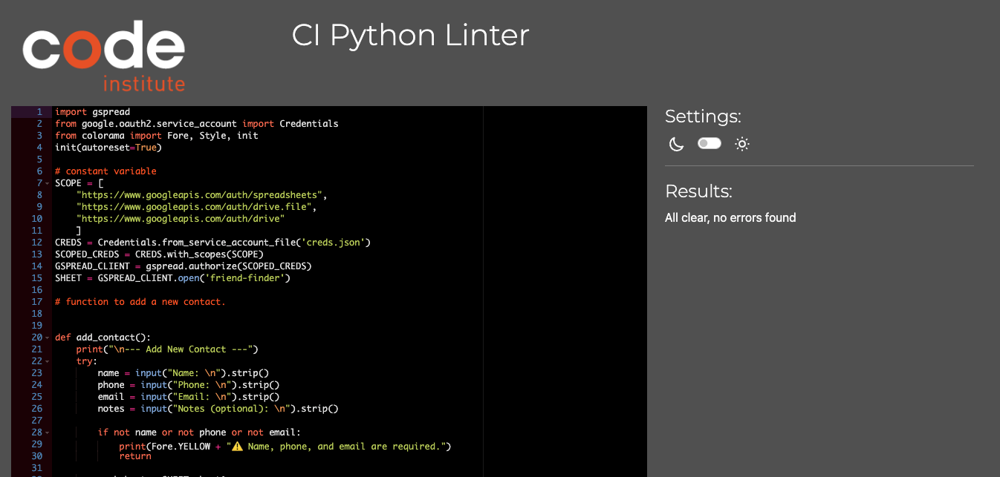
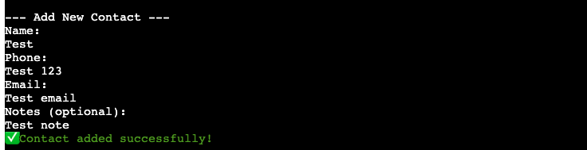
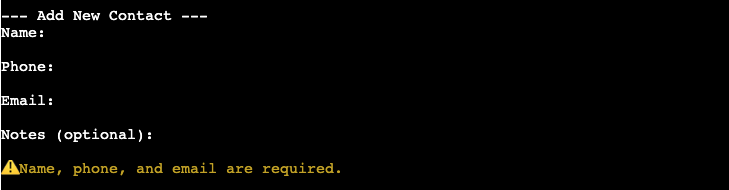
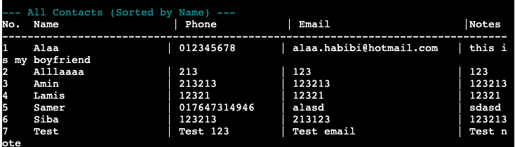
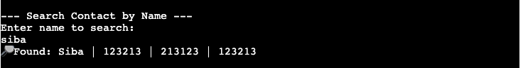
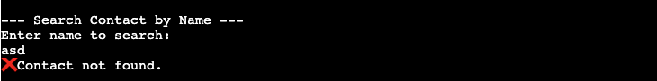
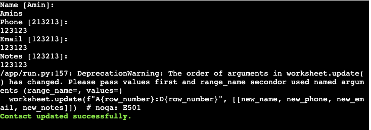
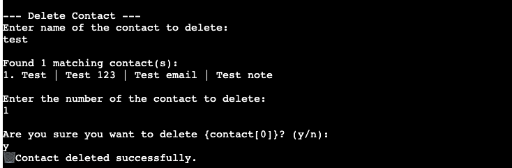

# Testing

> [!NOTE]
> Return back to the [README.md](README.md) file.

## Code Validation

### Python

I have used the recommended [PEP8 CI Python Linter](https://pep8ci.herokuapp.com) to validate all of my Python files.

| Directory | File | URL | Screenshot | Notes |
| --- | --- | --- | --- | --- |
|  | [run.py](https://github.com/allaafaham/friend-finder/blob/main/run.py) | [PEP8 CI Link](https://pep8ci.herokuapp.com/https://raw.githubusercontent.com/allaafaham/friend-finder/refs/heads/main/run.py) |  | Notes (if applicable) |

## Defensive Programming

Defensive programming was manually tested with the below user acceptance testing:

| Feature | Expectation | Test | Result | Screenshot |
| --- | --- | --- | --- | --- |
| Add Contact | Feature is expected to allow users to input valid contact information. | Entered various contacts with valid names, phone numbers, emails, and notes. | Contact was successfully added and saved to the Google Sheet. |  |
| | Feature should reject empty or incomplete fields. | Attempted to add a contact with missing fields (e.g., no name or phone). | Proper validation messages appeared; contact was not added. |  |
| View Contacts | Feature is expected to display all saved contacts clearly. | Viewed all contacts after multiple additions. | All contacts were displayed correctly in a readable format. |  |
| Search Contact | Feature should return the correct contact when searched by name. | Searched for an existing contact by name (case-insensitive). | Correct contact was returned. |  |
| | Feature should handle searches for non-existent contacts gracefully. | Searched using random, non-matching name. | Message displayed: "Contact not found." |  |
| Edit Contact | Feature is expected to allow editing of existing contact details. | Edited an existing contact’s email and notes. | Changes were updated correctly in the Google Sheet. |  |
| Delete Contact | Feature should allow safe deletion of contacts. | Deleted a specific contact after confirmation prompt. | Contact was successfully removed from the sheet. |  |

## User Story Testing

| Target | Expectation | Outcome | Pass |
| --- | --- | --- | --- |
| As a user | I want to add a new contact | so that I don’t lose their information. | x |
| As a user | I want to view all my saved contacts  | so that I can quickly find someone. | x |
| As a user | I want to search for a contact by name | so that I can find a specific person easily. | x |
| As a user | I want to update a contact’s details | so that I can keep information up to date. | x |
| As a user | I want to delete a contact | so that I can remove people I no longer need in my list. | x |
| As a user | I want my contacts to be saved even after I close the program | so that I don’t lose them. | x |
| As a user | I want to sort my contacts alphabetically | so that I can find them faster | x |
| As a user | I want to categorize contacts with tags like "Work" or "Family" | so that I can organize them better. | future feature |
| As a user | I want to protect my contact list with a password | so that nobody else can access it | future feature |

### Bugs

There are no remaining bugs that I am aware of, though, even after thorough testing, I cannot rule out the possibility.

